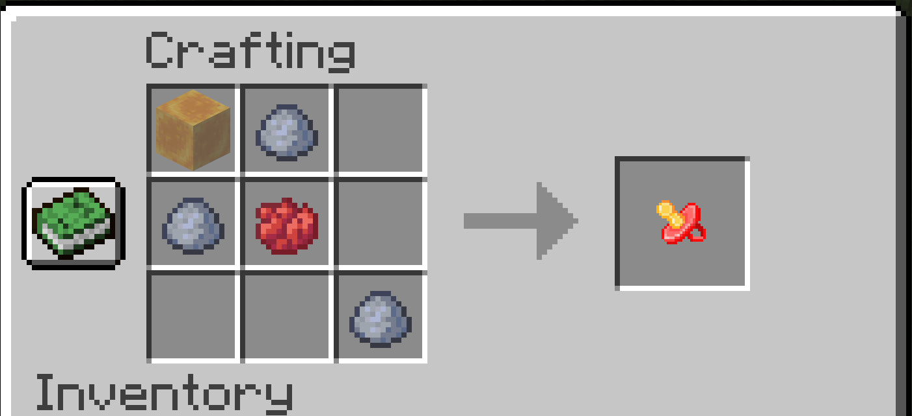
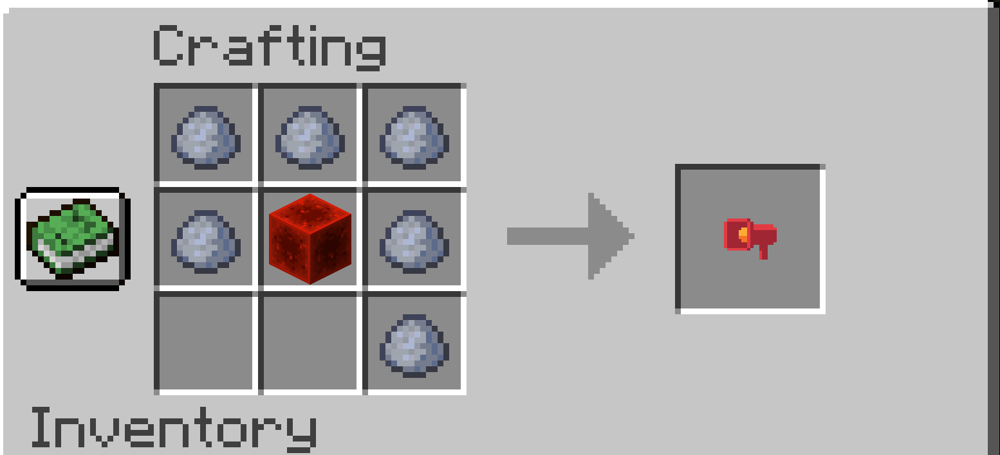

# Silencer Minecraft mod (Forge)

A Forge mod that provides an item that allows you to silence entities:

The silencer is craftable:

You can also craft an un-silencer which can be used to restore entities. It is also craftable:

Both items are stackable. When used by the player on an entity, the entity will be silenced/unsilenced, and the item will be consumed.

If the entity had been silenced/unsilenced before then nothing will happen, and the item will remain in the player's hand.