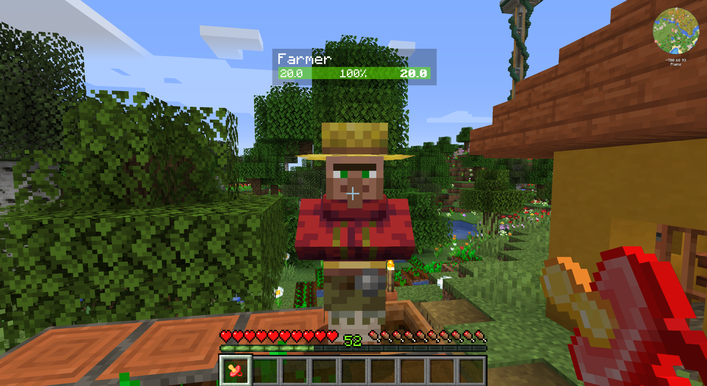

# Silencer Minecraft mod (Forge)

A Forge mod that provides an item that allows you to silence entities:

The silencer is craftable:

This is a stackable item. When used by the player on an entity, the entity will be silenced, and the item will be consumed.

If the entity had been silenced before then nothing will happen, and the item will remain in the player's hand.